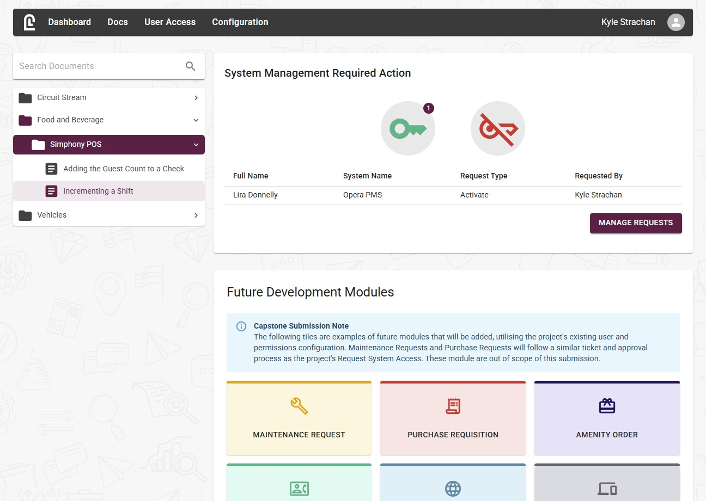
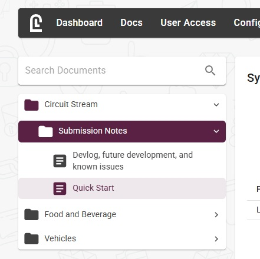

# LobbyLock
A MERN stack, secure, permission-based user access control system with a supporting documentation module tied to department membership.

## Screenshot


## Features
* **Frontend:** React + Vite
* **Backend:** Node.js, Express, MongoDB
* **Authentication & Security**
  * JWT authentication with bcrypt hashing
  * Permission-based routing and UI access
* **User Access Control**
  * Software access configuration panels
  * Ticket/request system with approval flow
  * Automatic revocation requests on termination
  * User password updates + admin resets
  * Summary dashboard to cross-reference system access
* **Documentation Module**
  * Department-based access permissions
  * Create/edit/archive documents
  * S3/Wasabi secure pre-signed image access
* **Extensible Architecture**
  * Modular platform structure for adding new modules

## Tech Stack
**Frontend:** React 19, Vite, MUI  
**Backend:** Node.js, Express, MongoDB, Mongoose  
**Auth:** JWT (access + refresh), HTTP-only cookies  
**Storage:** Wasabi/S3 for secure image uploads  

## How to Use, Devlog, Future Development and Known Issues
1. Login to the application using the credentials provided on the submission (username: **circuitstream**).
2. The Devlog, Future Development, Deployment and Known Issues notes are all available in the documentation feature of the app itself.
3. A **Quick Start** document is provided as a suggested way to explore the app.




## Back end installation and setup
### Installation
```
git clone https://github.com/kyle-strachan/back-end-kb-capstone.git
cd back-end-kb-capstone
npm install
```

### Setup
#### Prerequisites
1. Node.js
    1. Ensure `node` and `npm` are available in the command line.
2. MongoDB, running locally or remote.

#### Environment variables
Create a .env file in the back end's root directory with unique access and refresh secrets.
```
# MongoDB Connection String
MONGO_URI=mongodb://localhost:27017/lobbylock

# Server Configuration
PORT=3000

# JWT Secrets
ACCESS_SECRET=somesecret
REFRESH_SECRET=anothersecret

# Set to production for HTTPS cookie transmission
NODE_ENV=development

# Wasabi storage (for secure image upload - credentials provided on submission)
WASABI_KEY=
WASABI_SECRET=
WASABI_BUCKET=

# CORS - add front and back end ports as required for local hosting.
CORS_ORIGINS=http://localhost:3000,http://localhost:5173

```

For production environments, add `NODE_ENV=production` for HTTPS cookie transmission.

#### Run locally
```
npm run seed
npm start
```

### API Endpoints
Due to the secure, internal-facing nature of the system, most routes are protected and only accessible after authentication. The only public route is /login, used to initiate a session.

#### Auth Routes

| Method | Endpoint      | Description               |
|--------|---------------|---------------------------|
| POST   | `/login`      | Log in and receive tokens |


## Front end installation and setup
### Installation
```
git clone https://github.com/kyle-strachan/front-end-kb-capstone.git
cd front-end-kb-capstone
npm install
```

### Setup
#### Prerequisites
1. Vite

#### Environment variables
Create a .env file in the front end's root directory.
```
# API - adjust port as required
VITE_API_URL=http://localhost:3000/api
```

#### Run locally with Vite development server
```
npm run dev
```